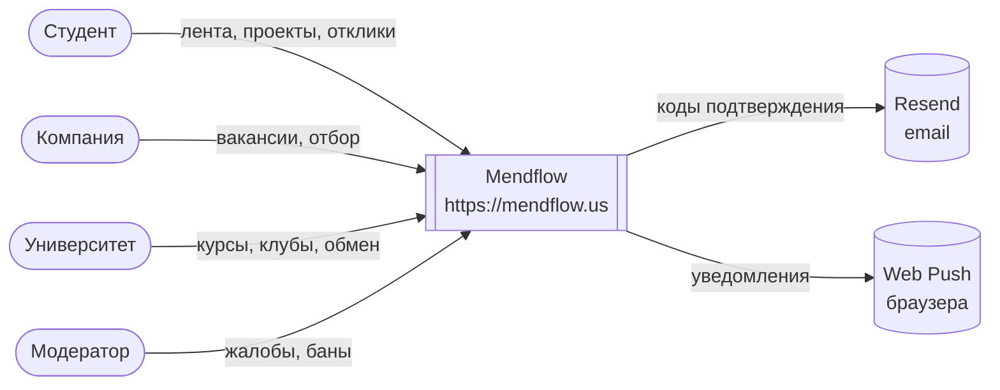
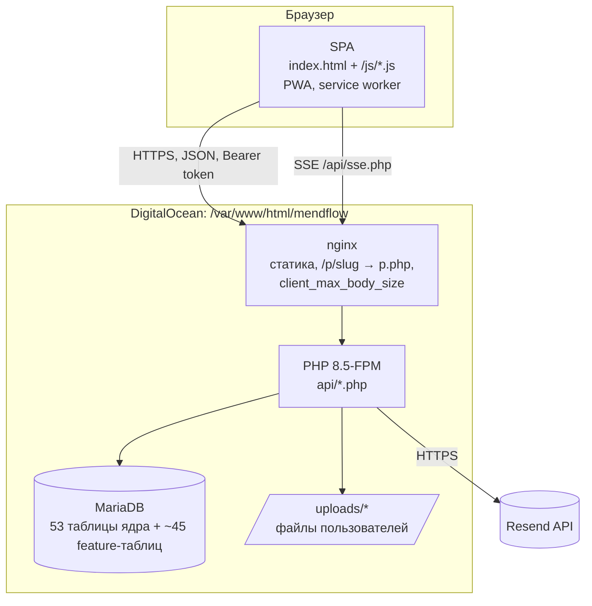
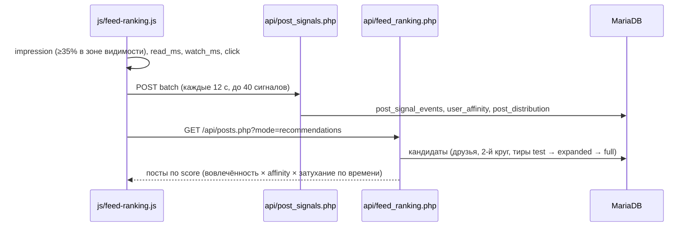

# Mendflow — архитектура (C4)

## Уровень 1. Контекст

## Уровень 2. Контейнеры

## Уровень 3. Компоненты API

| Компонент | Файлы | Ответственность |
|---|---|---|
| Ядро | `db.php`, `config.php` | PDO, CORS, `verifyToken()`, rate limit |
| Аутентификация | `register*.php`, `verify-email.php`, `login.php`, `auth_email.php`, `mail.php`, `forgot-password.php`, `reset-password.php` | регистрация трёх типов аккаунтов, код подтверждения, выдача токена |
| Социальный граф | `friends.php`, `friend_recommendations.php`, `network.php`, `blocks.php` | заявки, дружба, рекомендации |
| Лента | `posts.php`, `comments.php`, `like.php`, `reposts.php`, `post_signals.php`, `feed_ranking.php` | посты, сигналы вовлечённости, ранжирование |
| Проекты | `projects.php`, `project_*.php`, `p.php` | проекты, канбан, вехи, роли, публичные ссылки `/p/{slug}` |
| Карьера | `jobs.php`, `companies.php` | вакансии, отклики |
| Университеты | `universities.php`, `courses.php`, `events.php` | курсы, клубы, обмен, мероприятия |
| Realtime | `auth.php`, `sse.php`, `presence.php`, `typing.php`, `realtime_emit.php`, `push.php` | события в реальном времени, web push |
| Модерация | `admin.php`, `reports.php`, `moderation_lib.php` | жалобы, баны |

## Поток алгоритма ленты

