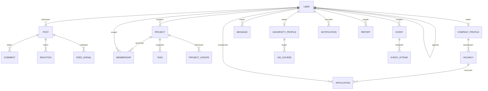

# Спринт 2. Формализация требований и планирование разработки

**Продукт:** Mendflow  
**Платформа:** https://mendflow.us  
**Команда:** (подставить ФИО)  
**Дата:** 24.09.2026  

Документ отвечает на задание «Формализация требований и планирование разработки».  
Система описывается как программный продукт: назначение, пользователи, сценарии, данные, концептуальная модель, предварительная архитектура, границы MVP и план до релиза.

---

## 1. Формализация требований к продукту

### 1.1. Назначение

Mendflow — социальная и карьерная платформа для студентов, университетов и компаний.  
Продукт связывает людей вокруг **проектов, обучения и стажировок**: студент собирает команду, публикует прогресс, находит события и вакансии; университет показывает курсы, клубы и обмен; компания публикует вакансии и видит кандидатов в том же пространстве, где студенты уже работают.

Это не исследовательская модель «в вакууме». Есть пользовательский интерфейс, API, хранение данных, уведомления и модуль ранжирования ленты.

### 1.2. Основные пользователи

| Роль | Кто | Зачем заходит |
|---|---|---|
| Студент | основной пользователь | профиль, лента, друзья, проекты, события, курсы, отклики на вакансии |
| Компания | работодатель / партнёр | страница компании, вакансии, отклики, публикации |
| Университет | вуз | страница вуза, курсы, клубы, обмен, подписчики |
| Модератор / admin | команда платформы | жалобы, блокировки, логи действий |

### 1.3. Ключевой сценарий (happy path)

1. Студент регистрируется по email, подтверждает почту, входит.  
2. Указывает интересы и город, проходит онбординг (интересы, проекты, люди).  
3. Создаёт или находит проект, вступает в команду (заявка / роль).  
4. Публикует пост в общую ленту и обновление в ленте проекта.  
5. Получает рекомендации постов и людей; откликается на вакансию компании.  
6. Компания видит отклик; студент получает уведомление о статусе.

**Критерий успеха сценария:** пользователь без сторонних инструментов проходит путь «регистрация → проект → публикация → отклик» и видит сохранённый результат после повторного входа.

### 1.4. Функциональные требования (проверяемые)

Формулировки — действия системы, а не «удобно / красиво».

**Аутентификация и профиль**

- Пользователь может зарегистрироваться как студент, компания или университет.  
- Система не выдаёт сессию до подтверждения email.  
- Пользователь может войти по email и паролю и получить токен сессии.  
- Пользователь может загрузить аватар и обложку; система сохраняет файлы и ссылки в профиле.  
- Пользователь может указать город, специальность и интересы; система использует их в рекомендациях событий и онбординге.

**Лента и социальный граф**

- Пользователь может создать текстовый пост с фото или видео.  
- Пользователь может поставить лайк, оставить комментарий, сделать репост.  
- Пользователь может отправить заявку в друзья; получатель может принять или отклонить.  
- Два пользователя с принятой дружбой могут обмениваться личными сообщениями.  
- Пользователь может пожаловаться на контент или другого пользователя; модератор видит жалобу со статусом.

**Проекты (ядро продукта)**

- Пользователь может создать проект с названием, описанием, категорией и стадией.  
- Владелец может приглашать участников и назначать роли доступа (owner / admin / member / viewer).  
- Участник может создавать задачи на канбане, менять статус, назначать исполнителя.  
- Участник может публиковать обновление проекта; подписчики видят его в контексте проекта.  
- Публичный проект открывается по ссылке `/p/{slug}` с превью для шаринга.

**Университеты и компании**

- Университет может вести курсы, клубы и программы обмена на своей странице.  
- Пользователь может подписаться на университет.  
- Компания может опубликовать вакансию или стажировку.  
- Студент может отправить отклик на вакансию; система сохраняет статус отклика.

**События, обучение, уведомления**

- Пользователь может создать мероприятие (онлайн / офлайн) и отметить участие.  
- Автор может опубликовать курс платформы; студент может записаться и отметить прогресс уроков.  
- Система доставляет уведомления о лайках, комментариях, заявках и событиях проекта.  
- Клиент получает обновления ленты и проекта по каналу Server-Sent Events.

### 1.5. Нефункциональные требования (проверяемые)

- Интерфейс открывается в современном браузере как одностраничное приложение (SPA).  
- API отвечает JSON; неуспешный вход без верификации почты даёт отказ (не «тихий» вход в ленту).  
- Загрузка медиа ограничивается настройками веб-сервера (лимит тела запроса).  
- Секреты БД и почты хранятся в окружении сервера, не в клиенте.  
- Публичная ссылка проекта индексируется (sitemap / мета-теги).

### 1.6. Границы проекта (MVP семестра vs вне скоупа)

**Входит в итоговую версию семестра (MVP+)**

- Регистрация трёх ролей, верификация email, вход.  
- Лента, лайки, комментарии, друзья, сообщения.  
- Проекты: создание, команда, канбан, посты проекта, публичная ссылка.  
- Вакансии и отклики.  
- Страницы вуза и компании (базовый контент).  
- События, уведомления, умная лента на накопленных сигналах.  
- Модерация жалоб на базовом уровне.

**Сознательно вне текущего MVP**

- Нативные iOS / Android приложения.  
- Полноценный мессенджер с звонками и групповыми чатами.  
- Платёжный шлюз и монетизация.  
- Отдельный микросервисный бэкенд и очередь сообщений.  
- Офлайн-режим и полноценный PWA-кэш API.  
- Автоматический HR-скрининг резюме нейросетью как отдельный продукт.  
- Федеративный поиск по внешним LinkedIn / HeadHunter.

---

## 2. Данные системы

### 2.1. Вход (что приходит в систему)

| Источник | Данные |
|---|---|
| Формы регистрации / входа | имя, фамилия, email, пароль, роль, код подтверждения |
| Профиль | город, био, интересы, аватар, обложка, организация |
| Лента | текст поста, файлы медиа |
| Проекты | название, описание, стадия, задачи, документы, часы загрузки |
| Карьера | поля вакансии, текст отклика |
| Клиент ленты | сигналы: показ карточки, клик, время чтения, время просмотра видео |
| Модерация | тип цели, причина, комментарий жалобы |

### 2.2. Результат работы модулей (что система вычисляет)

| Модуль | Выход |
|---|---|
| Auth | хеш пароля, токен сессии, факт верификации email |
| Ранжирование ленты | порядок постов, tier распространения (test / expanded / full), оценка affinity между пользователями |
| Рекомендации | список людей и проектов в онбординге |
| Проекты | slug публичной страницы, прогресс вех, статусы задач |
| Уведомления | записи для колокольчика и события SSE |
| Курсы | процент прохождения, средняя оценка |

«Основной алгоритм» продукта для аналитики спринта 6 — **ранжирование ленты и качество рекомендаций** (не отдельная ML-лабораторная модель, а прод-модуль на сигналах вовлечённости).

### 2.3. Что обязательно хранить

- Пользователи, сессии, коды почты.  
- Посты, лайки, комментарии, репосты.  
- Дружба, сообщения, блокировки, жалобы.  
- Проекты, участники, задачи, документы, активность.  
- Вакансии и отклики.  
- События и участия.  
- Агрегаты вовлечённости поста и сырые сигналы.  
- Уведомления.  
- Файлы в хранилище `uploads/` + URL в БД.

### 2.4. Метрики для спринта 6 (привязка к данным)

Метрики можно посчитать только из того, что система уже пишет.

**Качество основного алгоритма (лента)**

| Метрика | Как считается | Откуда данные |
|---|---|---|
| CTR поста | clicks / impressions | `post_engagement`, `post_signal_events` |
| Среднее время чтения | sum(read_ms) / показам | `post_engagement.read_time_ms` |
| Среднее время просмотра видео | watch_ms / показам с видео | `post_engagement.watch_time_ms` |
| Доля постов, вышедших из test-тира | expanded / все новые | `post_distribution.tier` |
| Корреляция affinity и взаимодействий | likes+comments+dm_shares vs показ | `user_affinity`, лайки, комментарии, `post_dm_shares` |

**Продуктовые**

| Метрика | Данные |
|---|---|
| Конверсия регистрации → подтверждённый email | `users.email_verified_at` |
| DAU / повторные входы | `sessions`, `users.last_seen` |
| Доля пользователей с ≥1 проектом | `project_members` |
| Заявки в команду: принято / всего | `project_join_requests`, `project_role_applications` |
| Воронка вакансий: просмотр → отклик → offer | `job_vacancies`, `job_applications.status` |
| Среднее время отклика на сообщение | `messages.created_at`, `is_read` |
| Доля мероприятий с ≥1 участником | `event_participants` |
| Частота ошибок API / жалоб | логи сервера, `reports`, `moderation_logs` |

**Нагрузка (для «времени обработки»)**

- время ответа эндпоинтов ленты и SSE (из логов nginx / PHP);  
- длина очереди сигналов до flush на клиенте (12 с) — косвенно латентность аналитики.

---

## 3. Концептуальная модель данных

На этом этапе — объекты предметной области и связи, **без** типов SQL и физических ключей.

### 3.1. Сущности и смысл

| Сущность | Смысл | Важные атрибуты (логические) |
|---|---|---|
| Пользователь | человек или представитель орг. | роль, email, профиль, верификация |
| Профиль компании | карточка работодателя | название, отрасль, город |
| Профиль университета | карточка вуза | название, город, описание |
| Пост | публикация в общей ленте | текст, медиа, автор, время |
| Реакция | лайк / репост | кто, какой пост |
| Комментарий | отзыв к посту | текст, автор |
| Связь дружбы | заявка или принятая пара | стороны, статус |
| Сообщение | личная переписка | отправитель, получатель, прочитано |
| Проект | командная единица работы | название, стадия, публичность, slug |
| Участие в проекте | членство | роль доступа, специализация |
| Роль в проекте | открытая вакансия в команде | слоты, статус |
| Задача | единица канбана | статус, исполнитель, срок, зависимости |
| Документ проекта | wiki / заметка | заголовок, иерархия |
| Обновление проекта | пост внутри проекта | тип (релиз, найм, веха) |
| Мероприятие | встреча / ивент | формат, город, время, организатор |
| Вакансия | предложение компании | тип (стажировка / работа), статус |
| Отклик | заявка студента | статус воронки |
| Курс платформы | обучающий материал | уровень, статус публикации |
| Сигнал ленты | факт внимания | показ, клик, время чтения |
| Уведомление | событие для пользователя | тип, прочитано |
| Жалоба | сигнал модерации | цель (полиморфно), причина, статус |

### 3.2. Связи (кардинальность)

- Пользователь **1 — 0..1** Профиль компании / Профиль университета.  
- Пользователь **1 — N** Посты, Проекты (как владелец), Сообщения, Уведомления.  
- Пост **1 — N** Реакции, Комментарии, Сигналы.  
- Пользователь **N — N** Пользователь через Дружбу и через Блокировку.  
- Проект **N — N** Пользователь через Участие.  
- Проект **1 — N** Задачи, Документы, Обновления, Роли.  
- Роль в проекте **1 — N** Заявки пользователей.  
- Компания **1 — N** Вакансии; Вакансия **1 — N** Отклики; Отклик **N — 1** Пользователь.  
- Университет **1 — N** курсы вуза, клубы, программы обмена.  
- Мероприятие **N — N** Пользователь через участие.  
- Курс платформы **N — N** Пользователь через запись.

Полиморфные связи (на концептуальном уровне): жалоба «на пользователя / пост / проект»; организатор мероприятия «пользователь или организация».

### 3.3. ER-диаграмма (концептуальная)



Полная физическая схема шире (канбан-колонки, ресурсы, SSE-буфер и т.д.) — она относится к спринту 3, не к концептуальной модели.

---

## 4. Предварительная архитектура

Архитектура на уровне компонентов. Детализация — после проверки PoC в спринте 3.

```text
Пользователь (браузер, SPA)
        │  HTTPS
        ▼
   nginx (статика, /api, /uploads, /p/{slug})
        │
        ├── index.html + JS-модули     → интерфейс
        ├── p.php                      → SEO публичного проекта
        └── PHP-FPM  api/*.php         → серверная часть
                │
                ├── MariaDB            → пользователи, лента, проекты, сигналы
                ├── uploads/           → файлы
                ├── SSE (sse.php)      → realtime (поллинг таблицы событий)
                ├── модуль ленты       → feed ranking (сигналы → порядок постов)
                └── Resend             → внешний API почты
```

| Компонент | Назначение |
|---|---|
| Интерфейс | один SPA (`index.html`, `/js/*`), роли меняют доступные экраны |
| Серверная часть | набор PHP JSON-эндпоинтов, сессия Bearer |
| База данных | MariaDB, источник правды |
| Вычислительный модуль | ранжирование ленты и affinity; запись сигналов с клиента |
| Файловое хранилище | локальный каталог за nginx |
| Внешние API | почта (Resend); карты событий (Leaflet / тайлы) |

Стек продакшена: nginx + PHP + MariaDB (DigitalOcean). Отдельного ML-сервиса нет: алгоритм крутится в PHP/SQL + клиентский сбор сигналов.

---

## 5. MVP

**MVP** — минимальная версия, в которой студент закрывает ключевой сценарий без «красивостей».

### 5.1. Обязательный сценарий MVP

1. Регистрация студента + подтверждение email + вход.  
2. Создание поста в ленте.  
3. Создание проекта и хотя бы одной задачи.  
4. Отклик на одну вакансию **или** заявка в команду проекта.  
5. Повторный вход: пост, проект и заявка на месте.

Если эти пять шагов работают на стенде — MVP выполнен.

### 5.2. Обязательные функции vs дополнительные

| Обязательно (MVP) | Можно позже (расширение семестра) |
|---|---|
| Auth и роли student / company | тонкая админка, бейджи |
| Лента: пост, лайк, комментарий | умный tier-распространения, A/B |
| Проект: создать, участники, канбан | загрузка ресурсов, Gantt, wiki-дерево |
| Дружба или сообщения (достаточно одного канала связи) | typing, presence |
| Вакансия + отклик **или** страница вуза | курсы платформы, статьи, Q&A |
| Загрузка одного типа медиа | видео, GIF, превью OG |
| Список уведомлений | Web Push, SSE |

Оценка реалистичности: ядро MVP уже реализовано в текущем репозитории; до конца семестра команда **дожимает качество сценария, метрики спринта 6 и релиз**, а не пишет продукт с нуля.

---

## 6. Планирование и управление задачами

**Инструмент доски:** GitHub Projects / Notion / Trello (создать доску с колонками: Backlog → Sprint N → In progress → Review → Done).  
**Поля карточки:** спринт, ответственный, статус.  
Ниже — содержимое доски. Имена исполнителей заменить на ФИО команды.

Логика до релиза: **проектирование → реализация → интерфейс и интеграция → аналитика → релиз**.  
Спринты **4 и 7 фиксированы** программой курса (контрольная интеграция и финальный релиз). Содержание 3, 5, 6 команда уточняет.

### 6.1. Карта спринтов до релиза

| Спринт | Фокус | Результат |
|---|---|---|
| 2 (текущий) | требования, данные, ER, архитектура, MVP, доска | этот документ |
| 3 | детальная архитектура, PoC алгоритма ленты | схема компонентов + работающий сбор сигналов |
| **4 (фикс.)** | интеграция основного сценария | демо: регистрация → проект → лента → отклик |
| 5 | интерфейс, роли, проекты, вакансии | связный UI без «дыр» в MVP |
| 6 | аналитика | дашборд/отчёт по метрикам п. 2.4 |
| **7 (фикс.)** | релиз | прод, чек-лист, защита |

### 6.2. Ближайшие два спринта — детальная декомпозиция

#### Спринт 3 — проектирование и PoC

| ID | Задача | Спринт | Ответственный | Статус |
|---|---|---|---|---|
| 3.1 | Зафиксировать C4 / схему компонентов (клиент, API, БД, ranking, SSE, почта, uploads) | 3 | архитектор | To do |
| 3.2 | Описать контракты API счастливого пути (register, verify, login, posts, projects, jobs) | 3 | backend | To do |
| 3.3 | Сверить концептуальную ER с фактическими таблицами, список расхождений | 3 | backend | To do |
| 3.4 | PoC: клиент шлёт impression/click/read_ms, сервер пишет `post_signal_events` | 3 | fullstack | To do |
| 3.5 | PoC: выдача ленты в режиме recommendations использует накопленные сигналы | 3 | backend | To do |
| 3.6 | Проверка верификации email на стенде (письмо приходит, вход без кода запрещён) | 3 | backend | To do |
| 3.7 | Список рисков (413 upload, SSE за прокси, дубли таблиц дружбы/комментов) | 3 | тимлид | To do |
| 3.8 | Критерии приёмки спринта 4 (скрипт демо на 5 минут) | 3 | тимлид | To do |

#### Спринт 4 — фиксированная интеграция (демо сценария)

| ID | Задача | Спринт | Ответственный | Статус |
|---|---|---|---|---|
| 4.1 | Сквозной сценарий студента на чистом аккаунте | 4 | QA / fullstack | To do |
| 4.2 | Сценарий компании: вакансия → отклик виден | 4 | backend | To do |
| 4.3 | Публичная ссылка проекта `/p/{slug}` открывается и шарится | 4 | frontend | To do |
| 4.4 | Регрессия логина, ленты, канбана после правок PoC | 4 | QA | To do |
| 4.5 | Запись демо / стенд для защиты контрольной точки | 4 | тимлид | To do |
| 4.6 | Баг-фиксинг блокеров сценария (P0) | 4 | вся команда | To do |

### 6.3. Спринты 5–7 (крупные эпики)

**Спринт 5 — интерфейс и интеграция**

- полировка онбординга и трёх ролей;  
- проекты: роли, заявки, канбан без потери данных;  
- вакансии и страница компании;  
- события: создание и отметка участия;  
- уведомления в шапке.

**Спринт 6 — аналитика**

- выгрузка CTR, времени чтения, воронки вакансий, конверсии email;  
- отчёт: гипотеза ранжирования, графики, вывод;  
- при необходимости простой экран «качество ленты» для команды (не обязательно публичный).

**Спринт 7 — релиз (фиксированный)**

- `./check-server-ready.sh` + деплой на mendflow.us;  
- чек-лист auth/upload/SSL;  
- пользовательская инструкция на 1 страницу;  
- защита: сценарий + метрики + границы MVP.

### 6.4. Как вести доску

- Одна карточка = одна строка таблиц выше.  
- Статусы: To do / In progress / Review / Done.  
- Не закрывать спринт 4, пока 4.1–4.3 не Done.  
- P0-баги класть в текущий спринт, не в backlog.

---

## Итог спринта 2 (артефакты)

| Требование задания | Где в документе |
|---|---|
| Спецификация требований | раздел 1 |
| Данные и метрики аналитики | раздел 2 |
| Концептуальная ER | раздел 3 |
| Предварительная архитектура | раздел 4 |
| MVP и границы | разделы 1.6 и 5 |
| Доска и план до релиза | раздел 6 |

Команда понимает: **что** строится (сеть студентов, вузов и компаний вокруг проектов и карьеры), **какие данные** копятся для оценки ленты и воронок, **какие компоненты** это обслуживают и **какими этапами** это доводится до релиза в спринте 7.
